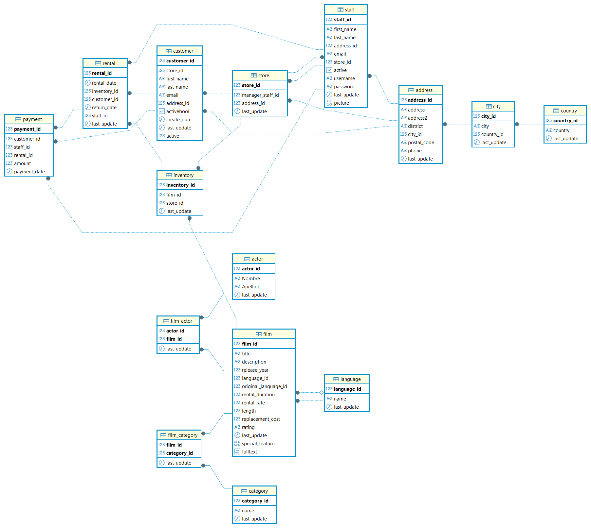

### **🎬 Proyecto de Análisis de Datos con SQL (negocio de alquiler de películas)**

### 📌 Descripción General del Proyecto

Este proyecto es un caso práctico de análisis de datos de un dataset relacional que representa un negocio de alquiler de películas.

El objetivo principal no es únicamente demostrar conocimientos técnicos de SQL, sino convertir datos relacionales en insights de negocio, simulando un escenario real de análisis en una empresa.

El proyecto incluye 64 ejercicios SQL de complejidad progresiva, que abarcan desde consultas básicas hasta análisis avanzados orientados a KPIs.

### 🎯 Objetivos del Proyecto

* Comprender y navegar un modelo relacional complejo
* Aplicar SQL avanzado con un enfoque orientado a negocio
* Analizar comportamiento de clientes, inventario e ingresos
* Demostrar código SQL limpio, legible y bien documentado

### 🛠️ Tecnologías Utilizadas

* Base de Datos: PostgreSQL
* Lenguaje: SQL (dialecto PostgreSQL)
* Herramientas: DBeaver / pgAdmin 4
* Dataset: BBDD_Proyecto

### 🧠 Conceptos SQL Aplicados

* JOINs: INNER, LEFT, FULL y CROSS JOIN
* Subconsultas y subconsultas correlacionadas
* Common Table Expressions (CTEs)
* Funciones de agregación y funciones estadísticas
* EXISTS / NOT EXISTS
* Vistas
* Tablas temporales
* Manipulación de strings y fechas
* Gestión de valores nulos con COALESCE

### 📊 Áreas de Negocio Analizadas

🎥 Gestión de Catálogo e Inventario

* Disponibilidad de películas en inventario
* Análisis de duración de películas por categoría
* Identificación de títulos con baja o nula cobertura de inventario

👥 Comportamiento del Cliente

* Segmentación de clientes según volumen de alquiler
* Identificación de clientes de alto valor
* Detección de alquileres con duraciones superiores a lo esperado

💰 Rendimiento Financiero

* Análisis de ingresos totales
* Ingresos por categoría de película
* Análisis estadístico de pagos y costes de reemplazo

🧑‍💼 Rendimiento Operativo

* Número de alquileres por día y por mes
* Análisis de rendimiento del personal
* Combinaciones tienda–empleado para planificación operativa

### 🔍 Ejemplos de Preguntas de Negocio Resueltas

* ¿Qué categorías de películas generan más alquileres?
* ¿Qué clientes alquilan un mayor número de películas distintas?
* ¿Existen alquileres que superen la duración prevista?
* ¿Qué actores participan en más películas del catálogo?
* ¿Qué películas se alquilan por encima del precio medio?

### 🏗️ Implementaciones Destacadas

✔️ Uso de CTEs

Las CTEs se utilizan para:

* Definir fechas de referencia (por ejemplo, el primer alquiler de una película)
* Mejorar la legibilidad de consultas complejas

✔️ Vistas

Se crean vistas reutilizables como actores\_numero\_peliculas para facilitar reportes recurrentes.

✔️ Tablas Temporales

Uso de tablas temporales para optimizar cálculos repetidos, como:

* Número total de alquileres por cliente
* Películas alquiladas con alta frecuencia

### 🚀 Principales Conclusiones

* Un segmento reducido de clientes concentra una parte significativa de los alquileres
* Algunas categorías son más rentables aunque no sean las más alquiladas
* Existe un porcentaje relevante de alquileres que superan el tiempo de devolución esperado
* La distribución del inventario no es homogénea en todo el catálogo

### 🚀 Estructura del Repositorio y Ejecución

Para replicar este análisis en tu entorno local, sigue estas instrucciones según la estructura de carpetas del proyecto:

📂 Organización de Archivos

/database: Contiene el archivo BBDD_Proyecto.sql. Este es el script necesario para crear las tablas e insertar los datos iniciales.

/scripts: Contiene el archivo BBDD_Proyecto_queries.sql con los 64 ejercicios resueltos.

/docs: Aquí encontrarás el Esquema Entidad Relacion (Esquema.png), que es el diagrama visual de las relaciones de la base de datos.

README.md: Guía principal del proyecto (este archivo).

### 🛠️ Pasos para la Instalación

1. Clonar el repositorio o descargar los archivos.

2\. Cargar la Base de Datos:

* Abre tu gestor de base de datos (DBeaver o pgAdmin 4).
* Crea una nueva base de datos llamada BBDD_Proyecto.
* Ejecuta el script situado en /database/BBDD_Proyecto.sql. Esto montará toda la estructura de tablas y datos.

3\. Explorar el Modelo:

Revisa el diagrama en /docs/Esquema.png para comprender las conexiones entre clientes, alquileres y películas.

4\. Ejecutar el Análisis:

Abre el archivo /scripts/BBDD_Proyecto_queries.sql.

Puedes ejecutar las consultas de forma secuencial para observar el progreso desde el análisis básico hasta los KPIs avanzados.

👤 Autora

Sara García Carretero

